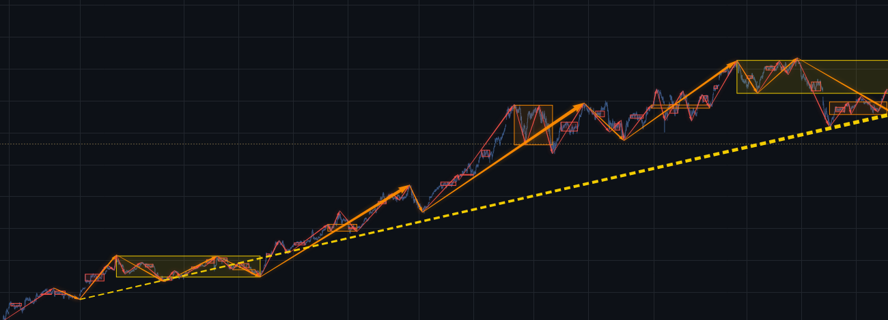

**级别不是你选出来的参数，是从走势里长出来的。**

大多数工具让你选周期：选 30 分钟，它给你 30 分钟的图。
但缠论里的"级别"从来不是这个意思——**低一级的走势构成高一级的段，
级别是一层层递归长出来的。**

缠析做的就是这件事。各级别可以逐级开关，你能亲眼看到
同一段行情在低、中、高三层下的形态，看几遍，"级别"这个概念就不再是书上的定义。

而在这之前，**笔和线段都不用你画**——K 线到线段、线段到走势与中枢，
引擎自动分解。省下数 K 线的力气，用在真正该琢磨的地方。

> 想先看看它长什么样：**[mychan.cn](https://mychan.cn)**

## 下载

到 [Releases](../../releases) 取最新版。**装上就能用**，分解引擎随包附带，
不用另外配置任何东西。

> 点下表里的链接直接下载。（[Releases](../../releases) 页面里那一堆 `.zip` 和 `.sig`
> 是应用自动更新用的，不用管。）

| 你的系统 | 点击下载（v0.2.0） |
|---|---|
| Windows 10 及以上 | [chanxi_0.2.0_x64-setup.exe](https://gitee.com/doo8w/mychan/releases/download/v0.2.0/chanxi_0.2.0_x64-setup.exe) ｜ [GitHub 镜像](https://github.com/traddo/mychan/releases/download/v0.2.0/chanxi_0.2.0_x64-setup.exe) |
| macOS（2020 年后的 Mac，M1/M2/M3…） | [chanxi_0.2.0_aarch64.dmg](https://gitee.com/doo8w/mychan/releases/download/v0.2.0/chanxi_0.2.0_aarch64.dmg) ｜ [GitHub 镜像](https://github.com/traddo/mychan/releases/download/v0.2.0/chanxi_0.2.0_aarch64.dmg) |
| macOS（更早的 Intel Mac） | [chanxi_0.2.0_x64.dmg](https://gitee.com/doo8w/mychan/releases/download/v0.2.0/chanxi_0.2.0_x64.dmg) ｜ [GitHub 镜像](https://github.com/traddo/mychan/releases/download/v0.2.0/chanxi_0.2.0_x64.dmg) |
| Linux（Ubuntu / Debian 等） | [chanxi_0.2.0_amd64.deb](https://gitee.com/doo8w/mychan/releases/download/v0.2.0/chanxi_0.2.0_amd64.deb) ｜ [GitHub 镜像](https://github.com/traddo/mychan/releases/download/v0.2.0/chanxi_0.2.0_amd64.deb) |
| Linux（其他发行版，免安装） | [chanxi_0.2.0_amd64.AppImage](https://gitee.com/doo8w/mychan/releases/download/v0.2.0/chanxi_0.2.0_amd64.AppImage) ｜ [GitHub 镜像](https://github.com/traddo/mychan/releases/download/v0.2.0/chanxi_0.2.0_amd64.AppImage) |

国内用左边的链接（Gitee）更快；打不开时用右边的 GitHub 镜像。

**不确定自己是哪种 Mac？** 点左上角苹果图标 →「关于本机」，
写着「芯片 Apple M…」选 aarch64，写着「处理器 Intel」选 x64。

### 首次打开

- **Windows** 会提示"Windows 已保护你的电脑"——点「更多信息」→「仍要运行」。
- **macOS** 首次需**右键点击图标 →「打开」**，直接双击会被系统拦下。
- **Linux AppImage** 下载后需先赋予执行权限：`chmod +x chanxi_*.AppImage`

> 这几步是因为安装包尚未做代码签名与公证，不是软件有问题。

## 怎么用

打开后左侧有三个视图，对应三种用法：

### 学习 —— 看别人怎么划的

打开精选行情片段，看分解好的结构。配合 `Ctrl+P` 渐进显示，
能看着走势与中枢随 K 线一根根推进而逐步长出来——**看到的时刻，就是当时真能判定的时刻**。

### 练习 —— 自己动手划

盲练：**线段作为已知条件给你**，走势和中枢自己画，画完对答案、自动打分。
——省掉的是画笔画线段的苦力活，要练的判断一样也不少。

练习时结构显示快捷键会被关掉，不能直接把答案调出来看。

### 复盘 —— 看自己关心的品种

> 原「自研」，0.2.0 起改名并重做了数据源设置。

导入你自己的行情数据，用同一套引擎做分解。支持三种来源：

- **通达信** —— 选 vipdoc 目录，自动认出品种；个股按本地权息文件前复权
- **MT4** —— 选 `history/<服务器名>` 目录，读 `.hst` 历史数据
- **自备 CSV** —— 任意来源的 K 线表格，列名自动识别

点清单上方的 **⚙** 打开数据源设置：选目录 → **输入代码过滤**（如 `600036`、`EURUSD`）
→ 勾选要看的 → 按「应用」。旁边的 **⟳** 是刷新——重读源文件、重跑分解，
你的选择和笔记都留着。

只使用 **1 分钟**数据。发布版一次最多导入 **10 个**品种。

导入的数据、你写的笔记、练习记录**全部存在你自己的电脑上，不上传**。

数据较长时默认分析最近两年，界面会写明截取了哪一段。

> MT5 的历史数据格式未公开，暂不直接支持；MT5 用户可在终端里
> `View → Symbols → 选品种 → Bars → Export Bars` 导出 CSV，再走「自备 CSV」。

**完整操作说明见 [用户手册](docs/user-manual.md)** —— 界面、快捷键、图表操作、
标注工具、分享功能都在里面。

## 反馈

用着有问题、或者觉得哪里该改，欢迎提 issue，也可以直接来信：
**trad_do@hotmail.com**

每版改了什么见 [更新记录](CHANGELOG.md)。

## 更新方式说明（0.2.0 起）

- 用 0.1.7 或更早版本的，收到「发现新版本 v0.2.0」时还需要下载安装一次——
  这是**最后一次**整机安装；
- 装上 0.2.0 之后，分解引擎和各个功能模块都会自己在线更新：应用启动后或你点
  「检查更新」时自行下载、校验、换上新版，**不用重装、也不用重启**，状态栏给一句提示；
- 只有应用本身有大改动时才需要重新安装，那种情况应用会明确告诉你。
